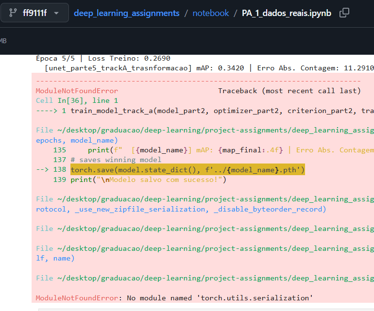
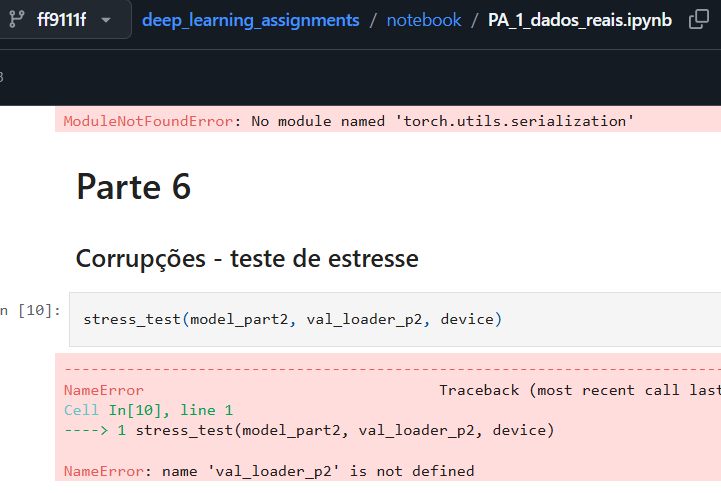

# Ambiente

Crie o ambiente virtual e baixe os pacotes como preferir. Recomendamos o uso do pacote uv:

```bash
pip install uv
uv sync
```

ele baixará as bibliotecas de acordo com o arquivo `pyproject.toml`, mas baixar as dependências com

```bash
pip install -r requirements.txt
```

também deve funcionar

# Checkpoints

Os pesos dos modelos treinados estão disponíveis na raíz do repositório, com nomes descritivos de qual parte do assingment o arquivo `.pth` se refere.

# Comando para avaliar o modelo

Rode o arquivo eval_network da seguinte maneira para testar o modelo final (o implementando na parte 5):

```bash
python eval_network.py
```

Se quiser testar algum outro modelo de outra parte, adicione mais um argumento ao comando:

```bash
python eval_network.py unet_part1
```

Há uma lista pré-estabelecida de modelos disponíveis para a avaliação. Caso adicione um nome inválido, o programa de avisará e te dará a lista de nomes válidos.

# Commits após data de entrega

Devido a alguns problemas, explicados abaixo alguns commits foram feitos apenas para garantir que o repositório estará adequado para a apresentação, mas todo o trabalho de implementação dos requisitos dos itens do PDF já havia sido terminado antes do prazo, como detalhado abaixo.

## Problema ao salvar os pesos do modelo da parte 5

Após o fim do treinamento do modelo da parte 5 o torch deu um problema inexplicável nos seus módulos internos que o impediu o salvamento dos pesos do modelo (arquivo `notebook/PA_1_dados_reais.ipynb`, commit `ff9111f`):

<div align="center">
  
</div>

Por isso, precisamos treinar o modelo novamente após o fim do prazo para subir seus pesos, mas todo o trabalho de desenvolver o modelo ja havia sido feito.

## Erros no notebook

Também rodamos novamente a célula do notebook que fazia o teste de estresse da parte 6, que estava desatualizada, feita com o loader de dados da parte 2, que acabou causando um erro quando rodado novamente o notebook (mesmo arquivo, mesmo commit):

<div align="center">
  
</div>